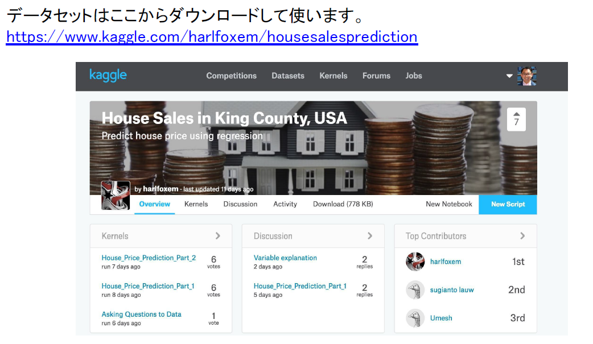

# Real Estate Broker Case Modeling

Kaggleのデータを使用し、KPIを分解し、打ち手の仮説を考え、機械学習のモデリングを作成

課題：不動産のセルサイドの手数料売り上げを増やしたい
打ち手：潜在顧客の売却検討中物件の予想成約価格のモデリング⇒予想売却価格を見るためのWebアプリをトップページに掲載する

## 1. 必要なライブラリを読み込む
## 2. データの読み込み
## 3. 要約統計量を出力する
## 4. Feature Engnieeringの際に有用なPandasの使い方
      カラムに関数を適用する
      ダミー変数を作る
## 5. 分布の確認(データ可視化）
      ヒストグラム
      散布図
      Group Byで集計して棒グラフ
      箱ヒゲ図(Boxplot)
## 6. 欠損の確認とその対応
## 7. 特徴量の作成 Feature Engineering
## 8. Scikit Learnを用いた予測モデルの構築
      機械学習アルゴリズム
      線形回帰モデル
      決定木
      ランダムフォレスト
     モデル評価はRMSE使用
#### 8-1. アルゴリズムの選択
#### 8-2. 変数選択
#### 8-3. クロスバリデーションによるパラメーターのチューニング
#### 8-4. テストデータへ適用して精度を確認
#### 8-5. 誤差の様子を可視化して確認
#### 9. この後ABテストを行ってユーザーに新サービスを見せてみて問い合わせやログインが増えているなど確認し十分増えているならシステムを作り課題克服へ実行していく
